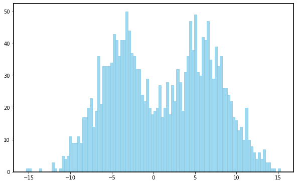

# Quantile Regression and Neural Networks for Predicting Data Sets

In the previous chapters, various models have been defined and detailed, leading to the structure of *Recurrent Neural Networks*, the model that will help us most effectively predict our data set. Additionally, emphasis has been placed on the different assumptions considered at each moment: good control of these is what allows us to identify the best model for each situation. Finally, examples have been given using the mean squared error as a loss function (one of the most employed methods) under the assumptions of normality, independence, etc. But what happens when these starting hypotheses are not met? The presence of heteroscedasticity, structural changes, or outliers are some of the most common circumstances that lead to such violations.

In 1978, Koenker and Basset introduced the well-known *Quantile Regression* as a solution to these problems. Since it is based on an estimation method that minimizes weighted absolute deviations with asymmetric weights, on the one hand, it ensures that the model is not affected by extreme data. On the other hand, it allows for a better description of the data set being treated.

## Quantile Estimation

### Definition
Let $X$ be a random variable. The theoretical quantile of order $p$ ($0<p<1$) is defined as the value $x_p$ such that:
\[ \mathbb{P}(X\leq x_p) = p \]

Given a sample $x_1,\dots, x_n$, the sample quantile of order $p$ ($0<p<1$) is defined as the value $x_p$ that leaves a proportion $p$ of observations below $x_p$.

In the original article by Koenker and Basset, the sample quantile of order $p$ is defined through an expression to be minimized:
\[ \min_{x_p\in \mathbb{R}}\left[\sum_{x_i > x_p} p|x_i -x_p| + \sum_{x_i\leq x_p}(1-p)|x_i -x_p| \right] \]

It can be verified that the optimal value $x_p$ is such that $p = \frac{\#\{x_i\leq x_p\}}{n}$. Therefore, it is equivalent to the given definition.

The idea of quantile regression is to describe the quantile of order $p$ of the data, instead of the mean (as is usual). This concept can be thought of from two different perspectives.

### Functional Perspective
The article presents the idea of quantile regression from a functional perspective based on using the above expression as a risk function, instead of the mean squared error. In this way, the property of the data being modeled is the quantile; more specifically, $Quant_p (X)$. From this argument, the following definition arises.

#### Quantile Loss Function
\[ L(x,x_p) = \begin{cases}
                p|x-x_p| \quad\quad\quad\,\,\, \text{if }x > x_p \\
                (1-p)|x-x_p| \quad \text{if } x\leq x_p
              \end{cases}
\]

### Statistical Perspective
Any loss function can be derived from a likelihood. Below, the deduction of this is made to approach the idea of Koenker and Basset from a statistical perspective.

#### Definition
A random variable has an $ALaplace(\theta, \sigma, p)$ distribution if its density function is
\[ f(x) = \begin{cases}
                \frac{p(1-p)}{\sigma} e^{-p\frac{x-\theta}{\sigma}} \quad \quad\quad \text{, if }x>\theta \\
                \frac{p(1-p)}{\sigma} e^{(1-p) \frac{x-\theta}{\sigma}} \quad \quad \text{, if }x\leq\theta
          \end{cases} \quad\quad 0<p<1
\]

Let $X$ be a random variable with an $ALaplace(\theta, \sigma, p)$ distribution with $0<p<1$. Consider the sample $x_1, \dots, x_n \in X$ independent and identically distributed. Next, we formulate the problem of maximizing the likelihood of this sample:
\[ \mathcal{L}(\theta,\sigma; x) = \prod_{i=1}^n f(x_i) \iff l(\theta,\sigma; x) = \sum_{i=1}^n \log f(x_i) \]

Using the quantile loss function, we can write this log-likelihood in a compact form:
\[ l(\theta,\sigma; x) = n\log(p(q-p)) - n\log \sigma - \frac{1}{\sigma}\sum_{i=1}^n L(x_i, \theta) \]

And by developing the maximization process, we obtain the following expression:
\[ l(\theta,\sigma; x) = n(\log(p(1-p)) -1 -\log(L(x_i,\theta))) \propto -L(x_i,\theta) \]

Minimizing the risk function imposed by Koenker and Basset is equivalent to maximizing the likelihood function of a sample with an $ALaplace$ distribution. Therefore, for a fixed value $0<p<1$, the maximum likelihood estimator $\hat{\theta}_p$ approximates the quantile of order $p$ of $X$.

#### Quantile Function
The quantile function is defined as the function $Q:(0,1) \rightarrow \mathbb{R}$ such that
\[ Q(p) = \inf\{x\in \mathbb{R} \,|\, p \leq \mathbb{P}(X\leq x)\} \]

We can think that $Q(p) \approx \hat{\theta}_p$, and therefore we can obtain an approximation of the image of $Q$, considering different values of $p=p_i$. Given that $Q^{-1}(x) = \mathbb{P}(X\leq x)$, we also have an approximation of the distribution function of $X$. Finally, we can obtain an approximation of the density function of $X$ by constructing a histogram from the $\hat{\theta}_{p_i}$.

## Linear Quantile Regression
The idea presented in the previous section can be quickly generalized to the linear model:
\[ Y \sim X\beta + \varepsilon \]

Following the definition, the error term $\varepsilon$ is considered to have an $ALaplace(0,\sigma,p)$ distribution. It can be shown that:
\[ X\beta + \varepsilon \sim ALaplace(X\beta,\sigma,p) \]

Therefore, in this case, the quantile of order $p$ of $Y|X$ is being described:
\[ Quant_p (Y|X) = \beta_0 +  \beta_1 X_1 + \dots + \beta_m X_m \]

Instead of obtaining a single line describing the conditional mean, as occurs in the case of normal errors, we obtain a line for each $p$ that leaves a proportion $p$ of data below it.

To better illustrate this, we have simulated three samples of sizes $n=2000$ for the first and $n=1000$ for the other two, of the following random variables:
\[ X\sim N(0,1) \quad \varepsilon_1 \sim N(-5,1) \quad \varepsilon_2 \sim N(5,1) \]

The sample of the response variable has been defined as $Y = \beta_0 + \beta_1 X + \varepsilon$, where $\varepsilon$ represents the bimodal random variable containing the same proportion of elements from $\varepsilon_1$ and $\varepsilon_2$. In practice, this translates to the union of the two samples from $\varepsilon_1$ and $\varepsilon_2$.

  <figure style="display: inline-block; text-align: center; margin: 10px;">
    
    <figcaption>Figura 1: Empirical distribution.</figcaption>
  </figure>
  <figure style="display: inline-block; text-align: center; margin: 10px;">
    
    <figcaption>Figura 2: Estimated lines.</figcaption>
  </figure>
  <figure style="display: inline-block; text-align: center; margin: 10px;">
    
    <figcaption>Figura 3: Empirical distribution of $Y|X=1$ constructed using the quantiles estimated with quantile regression.</figcaption>
  </figure>

## Quantile Neural Network
Similarly to linear regression, we can generalize this to other models; in this case, to neural networks. The training of a network depends on the loss function used. Alternatively, from a statistical perspective, it depends on the distribution of the error being assumed. Examples have shown that if we take the mean squared error as a risk function, the optimal solution is the conditional expectation, and consequently, the network predicts this measure. However, if we consider the quantile loss function (or equivalently, assume that the error is distributed with an $ALaplace(0,\sigma,p)$), we achieve modeling the quantile of $Y|X$.

Next, a sample is generated to illustrate this concept. We consider a sample of size $n=2000$ of the following random variables:
\[ X \sim U(-5,5) \quad \varepsilon_1 \sim N(-5,1) \quad \varepsilon_2 \sim N(5,1) \]

We define $Y = X^2 + \varepsilon$, where $\varepsilon$ is the bimodal random variable defined with $\varepsilon_1$ and $\varepsilon_2$. We train a neural network with 3 layers of 10 neurons each, and a final output layer.

  <figure style="display: inline-block; text-align: center; margin: 10px;">
    
    <figcaption>Figura 4: Functions approximated by a neural network trained with quantile estimation.</figcaption>
  </figure>
  <figure style="display: inline-block; text-align: center; margin: 10px;">
    
    <figcaption>Figura 5: Empirical distribution of $Y|X=1$ constructed using the quantiles estimated with quantile regression.</figcaption>
  </figure>

## Quantile Crossing Problem
Since the distribution function is monotonically increasing, by definition, it satisfies the order relation:
\[ p_1 \leq p_2 \implies Q(p_1) \leq Q(p_2) \]

Given that we are approximating these quantiles, it is common for this order relation not to be satisfied due to model error. To correct this error, an improvement in the method is proposed.

Instead of training a model for each quantile, the structure is modified so that the output has $m$ variables corresponding to the $m$ quantiles to be approximated. In this way, we can modify the loss function to preserve the order relation.

#### Regularized Quantile Loss Function
\[ \bar{L}(x_j,x_{p_j}) = \sum_{j=1}^m L(x_j,x_{p_j}) + \lambda \mathbb{1}_{\{ p_{i-1} \geq x_{p_i}\}}(x_{p_i}) \]

where $L$ is the Quantile Loss Function and $\lambda\in \mathbb{R}$ is the regularization coefficient.

The idea is based on adding a term that penalizes the non-compliance of the order relation by subtracting two consecutive predictions.

  <figure style="display: inline-block; text-align: center; margin: 10px;">
    
    <figcaption>Figura 6: Functions approximated by a neural network trained with the improved quantile estimation method.</figcaption>
  </figure>
  <figure style="display: inline-block; text-align: center; margin: 10px;">
    
    <figcaption>Figura 7: Empirical distribution of $Y|X=1$ constructed using the quantiles estimated with quantile regression.</figcaption>
  </figure>

The main difference lies in the permissibility of calculating closer quantiles with greater certainty of not crossing. Consequently, obtaining a more accurate result.

