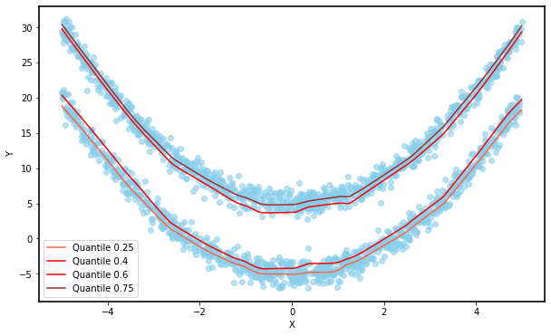

# Quantile Regression

In 1978, Koenker and Bassett introduced Quantile Regression to address these problems. This method minimizes weighted absolute deviations with asymmetric weights, making it robust to extreme data and providing a better description of the dataset.

Quantile Estimation involves defining the theoretical and sample quantiles. Koenker and Bassett's method involves minimizing a specific expression to find the sample quantile, which matches the definition based on order statistics.

Quantile regression describes the quantile of order $p$ of the data instead of the mean. This can be approached from a functional perspective, where the quantile is modeled directly, or from a statistical perspective, linking it to likelihood maximization.

Linear Quantile Regression generalizes this idea to linear models, showing that instead of a single regression line, multiple lines for different quantiles are obtained, each representing a different proportion of the data.

An example is given with simulated data to illustrate how quantile regression can better model data with non-normal errors compared to traditional least squares regression.

Quantile Neural Networks extend quantile regression to neural networks. By using a quantile loss function, neural networks can model the quantile of $Y∣X$ rather than the mean. An example demonstrates how a neural network trained with this approach can approximate different quantiles and the conditional distribution of the response variable.

The Quantile Crossing Problem occurs when the estimated quantiles do not maintain their natural order due to model errors. To address this, a regularized quantile loss function is introduced, which penalizes non-compliance with the order relation, leading to more accurate results.

The document concludes with an improved method that trains a model for multiple quantiles simultaneously, ensuring the order relation is preserved and providing more accurate approximations.

  <figure style="display: inline-block; text-align: center; margin: 10px;">
    
  </figure>
  <figure style="display: inline-block; text-align: center; margin: 10px;">
    
  </figure>

  <figcaption style="margin-top: 10px; margin-bottom: 20px;"><strong>Figure 1:</strong> Functions approximated by a neural network trained with the improved quantile estimation method and the aproximated density function with the method described.</figcaption>

