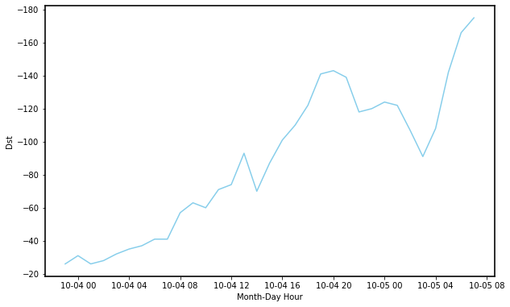

# Geomagnetic Storm Prediction Model

Geomagnetic storms, also known as solar storms, are disturbances of the Earth's magnetic field. They are mainly caused by solar wind waves and coronal mass ejections. In recent years, several storms have been recorded that have caused severe damage to electrical and electronic systems, satellites, communication devices and other devices that use the Earth's magnetic field as a reference. In an era where all these technologies are of great importance in many aspects of daily life, from individuals to large companies, precise control of these extreme phenomena is crucial.

The severity of these solar storms is measured by the **Disturbance Storm-time**, **_Dst_**, index. Although significant advances have been made in recent decades in predicting the _Dst_ through physical studies and machine learning models, there are still gaps in understanding how this data behaves.

Therefore, it is essential to develop more sophisticated models that not only predict the _Dst_ index but also estimate its conditional density. This approach would allow a more detailed and accurate understanding of geomagnetic fluctuations, thereby improving the response capacity to potential damage caused by solar storms.

## Problem Statement

The main objective is to create a model for the _Dst_ using various geomagnetic data to understand these events and prevent technological damage that could result from the unforeseen occurrence of one of these storms. More specifically, it is proposed to:

- Design and implement a model capable of explaining the _Dst_ variable at the current time using known variables. Specifically, approximate the distribution and density of the _Dst_ conditioned on the other observations. The model must be robust for any value especially extreme ones.
- Accurately describe the tail of this distribution to make predictions about a threshold of the _Dst_ value and estimate the probability of occurrence of an extreme event.
- Propose a family of distributions that coherently fits the real law of the _Dst_ conditioned on the other variables.

In order to achieve the previous goals, the following geomagnetic real data has been chosen. NASA's Advanced Composition Explorer (ACE) and NOAA's Deep Space Climate Observatory (DSCOVR) satellites provide various solar wind data every minute. This data has been directly extracted from the official NASA and NOAA websites over three different time periods. The following details each of these:

- The components $(x,y,z)$ of the interplanetary magnetic field (IMF) in geocentric solar ecliptic (GSE) coordinates, measured in nanoteslas.
- The components $(x,y,z)$ of the IMF in geocentric solar magnetospheric (GSM) coordinates, measured in nanoteslas.
- The magnitude of the IMF vector, in nanoteslas.
- The latitude of the IMF in GSE and GSM coordinates, defined as the angle between the magnetic vector and the ecliptic plane, measured in degrees.
- The longitude of the IMF in GSE and GSM coordinates, defined as the angle between the projection of the magnetic vector on the ecliptic and the Earth-Sun direction, measured in degrees.
- The proton density of the solar wind, in $N/cm^3$.
- The mass speed of the solar wind, in $km/s$.
- The ion temperature of the solar wind, in Kelvin.

Due to the high correlation between solar cycles and geomagnetic storms, sunspot number data \cite{SILSO_Sunspot_Data} during the same time period has also been included; in this case, the records are monthly. Additionally, since the ACE and DSCOVR satellites are not stationary but orbit around the Earth-Sun Lagrange point _L1_ in a constant relative position to the Earth \cite{NOAA_DSCOVR}, the daily position of these two satellites has also been considered. Finally, the hourly _Dst_ values calculated by the four ground observatories have been taken as the response variable of the model.

## Design and Implementation

This section describes the implemented model to approximate the conditional distribution of the _Dst_ given the mentioned features. As shown in Figure 1, it is based on three stages: preprocessing, the neural network and the distribution calculation. The process used in each of these is detailed below.

  <figure>
    
    <figcaption><strong>Figure 1:</strong> Architecture of the implemented model</figcaption>
  </figure>

### Preprocessing

The two main problems that arise when working with real data like the ones we are dealing with are diversity in the format of the different data sources and missing values.

First, the data is divided into two subsets: training and test. A portion of 20% is separated as the test set to evaluate the model's performance at the end of the process. The remaining data is used to train the model. From this point on, we work with the training set to avoid problems like _data leakage_, which can lead to an incorrect and overly optimistic evaluation of the model.

We start by processing the solar wind data set. First, missing data is imputed using interpolation. This method has been chosen due to the nature of the data: being a time series, it is necessary to preserve the continuity of the data and maintain their patterns and trends. Next, to transform the data into hourly, the median of each hour is calculated. As seen in Figure 2, the appearance of heavy tails for large values in the variables presented as examples is noted. The data is not symmetrical and tends to present outliers, concluding that the mean is not a representative measure of the data. Instead, the median helps reduce the effect of these extreme values that may not be representative and allows us to handle the asymmetry of the data. Additionally, an extra variable with the standard deviation of each hour is added to understand the variability of each feature.

  <figure style="display: inline-block; text-align: center; margin: 10px;">
    
  </figure>
  <figure style="display: inline-block; text-align: center; margin: 10px;">
    
  </figure>
  <figure style="display: inline-block; text-align: center; margin: 10px;">
    
  </figure>

  <figcaption style="margin-top: 10px; margin-bottom: 20px;"><strong>Figure 2:</strong> Distribution of the magnitude of the IMF, proton density and ion temperature</figcaption>

Second, we merge the sunspot data. Since we only have monthly information, missing data is imputed with the most recent value. This technique is used because the primary objective of including this data is to capture the influence of the eleven-year solar cycles; the scale of a cycle is too large to notice effects on an hourly basis.

Third, we include the daily coordinates of the two satellites. Since there are observations from both ACE and DSCOVR, depending on the period, the corresponding coordinates must be merged. In cases where we do not have a reference from which satellite the information comes from, it is imputed with the most recent value.

Finally, we prepare the _Dst_ data set by creating a second variable corresponding to the _Dst_ value one hour earlier. This will help us predict the _Dst_ using previous values. It should be noted the distribution of this variable, observed in Figure 3. We note the presence of non-symmetrical data with a tendency towards extreme negative values, creating a heavy tail. This is reflected in the QQ-plot, also in Figure 3, allowing us to conclude that we are dealing with non-normal data. Recognizing this non-normality is important for choosing the appropriate statistical methods for analysis.

  <figure style="display: inline-block; text-align: center; margin: 10px;">
    
  </figure>
  <figure style="display: inline-block; text-align: center; margin: 10px;">
    
  </figure>

  <figcaption style="margin-top: 10px; margin-bottom: 20px;"><strong>Figure 3:</strong> Distribution of the response variable, the Dst index y QQ-plot of the response variable, the Dst index</figcaption>

Finally, we normalize the data so that our model interprets each variable's contribution fairly and accurately, without being biased by scale differences.

### Quantile Recurrent Neural Network

Since we are dealing with time series, the chosen model is a Recurrent Neural Network. This type of neural network is particularly well-suited for time series analysis because it can consider past information when predicting the current $Dst$ value. By maintaining an internal state that captures information from previous time steps, the RNN can effectively model temporal dependencies within the data. This way, the model can incorporate historical context to make more accurate predictions.

Additionally, to approximate the distribution of the _Dst_ conditioned on the other features, the quantile loss function is chosen (with a restriction parameter $\lambda = 10^{-4}$).

Finally, following the notation in Chapter \ref{2}, the defined hyperparameters are: sequences of length $T = 34$, number of neurons $K=256$ and $m=100$ output values, corresponding to each of the quantiles. In this case, a uniform partition of the interval $(0,1)$ has been considered.

It should be noted that, to ensure better generalization of the model, the use of regularization techniques could be considered. Additionally, optimizing additional hyperparameters such as the learning rate and the type of optimizer (for example, AdaGrad or RMSprop) could lead to improvements in model performance. However, both for computational reasons and because it deviates from the ultimate goal of this work, they have been fixed in advance.

The model is trained with 80% of the data over 500 epochs. An epoch refers to one complete pass through the entire training dataset, during which the model updates its weights based on the loss function. Training over 500 epochs ensures that the model has sufficient opportunities to learn the patterns within the data.

### Distribution computation

Once the model has been trained, predicting a new observation results in a set of $m$ $p_i$-quantiles, for $i=1,\dots,m$. That is,

$$
\hat{F}(X) = (\hat{Q}(p_1),\dots, \hat{Q}(p_m)).
$$

On the one hand, the points $(\hat{Q}(p_i), p_i)$ plot the distribution function. On the other hand, if we process the results following the Quantile Regression method, the density function is plotted.

From this point, we have the necessary tools to conduct a detailed analysis and answer the questions posed at the beginning.

## Results

Finally, all the results extracted from the implemented model are detailed in the following section. This model has allowed estimating the entire distribution and, because of this, some other studies has been done.

### Estimated distribution and density function of $Y|X=x$

As it has been explained, the proposed model not only allows predicting a single value but approximates the entire distribution. The approximation of the distribution and density functions of a new observation, where the _Dst_ value at the current time is $-153$, is shown in Figure 4.

  <figure>
    
  </figure>
  <figure>
    
  </figure>

  <figcaption style="margin-top: 10px; margin-bottom: 20px;"><strong>Figure 4:</strong> Distribution function and density function approximated by the model</figcaption>

### Testing the model

To verify the robustness of the model, we use the fact that any random variable applied to its distribution function results in a uniform random variable. Considering that each real value $y_i$ is a realization of the true conditional distribution and considering the previous result, the set $\{p_i \,|\, y_i = \hat{Q}(p_i), i=1,\dots,m\}$ should be a uniform sample. In Figure 4, this behavior is observed for both the training and test sets. This allows us to give some credibility to the results obtained below.

  <figure style="display: inline-block; text-align: center; margin: 10px;">
    
  </figure>
  <figure style="display: inline-block; text-align: center; margin: 10px;">
    
  </figure>

  <figcaption style="margin-top: 10px; margin-bottom: 20px;"><strong>Figure 5:</strong> Histogram of the sample of probabilities for each real Dst value according to the approximate distribution, for some training set observations y Histogram of the sample of probabilities for each real Dst value according to the approximate distribution, for all test set observations</figcaption>

### Study of the distribution shape

Returning to the previous example, the first q cony notable characteristic is the unimodality and improvement in the symmetry of the conditional distribution $Y|X$ compared to that of $Y$. In other words, the model provides a simplification of the _Dst_ law, making it easier to study. However, the appearance of long tails and the information from the QQ-plot suggest that the distribution is not normal, as it can be seen in Figure 6.

  <figure style="display: inline-block; text-align: center; margin: 10px;">
    
  </figure>
  <figure style="display: inline-block; text-align: center; margin: 10px;">
    
  </figure>

  <figcaption style="margin-top: 10px; margin-bottom: 20px;"><strong>Figure 6:</strong> Comparison between the approximate distribution and a normal distribution y QQ-plot of the empirical distribution relative to a normal distribution</figcaption>

### Estimated left tail of the $Y|X=x$ distribution

The previous observation, along with the fact that the model approximates the whole rang of the left tail, leads us to fit a function $f$ that coherently approximates this tail. Given its monotonous decline, it is proposed to fit it with an exponential function. Therefore, for $y\in \mathbb{R}$ small enough, the structure is

$$
f(y) = e^{a+by}.
$$

One way to fit this function $f$ is through a logarithmic transformation and simple linear regression. Following the model linear definition, the quantiles calculated by the model through the fixed probabilities, that can be thought of as realizations of a random variable, along with least squares give us the approximation shown in Figure 7.

  <figure style="display: inline-block; text-align: center; margin: 10px;">
    
  </figure>
  <figure style="display: inline-block; text-align: center; margin: 10px;">
    
  </figure>

  <figcaption style="margin-top: 10px; margin-bottom: 20px;"><strong>Figure 7:</strong> Logarithmic relationship of the tail points, where it can be seen that the described form of f is consistent and fits well to the tail of the distribution approximated by the model, formed by the lower 15% of the data</figcaption>

### Inference in extreme values

Once the conditional tail distribution function $f$ is fitted, an extreme event can be accurately predicted. Concretely, the following statements can be analyzed:

- Determine a lower bound given a confidence level $p$.
- Determine a probability given a lower bound.

Each of these problems is formulated using the expression

$$
\mathbb{P}(Y\leq y\,|\, X=x) = 1-p \iff \int_{-\infty}^y f(s) ds = \frac{1-p}{0.15},
$$

where $\mathbb{P}(Y\leq u\,|\, X=x)=0.15$ and $p>0.85$. Thanks to this result, the model allows us to make inference in the hourly $Dst$ value. Concretely, given the geomagnetic observations from the NOAA and DSCOVR satellites and the number of sunspots over 35 hours, along with the $Dst$ values measured by the 4 ground observatories over the previous 34 hours, the model can predict the current minimum $Dst$ value with a $90\%$ probability (or the chosen probability $p>0.85$). Additionally, it provides the probability of a solar storm occurrence, considering the effects to be catastrophic starting from a value of $-200$ (or the chosen threshold).

Considering October 5, 2000, at 8:00 AM. The value of $Dst$ at that hour was $-153$ (an observation to which the implemented model has been applied and the tail has been adjusted as described). Using the 35-hour sequence of the mentioned data, along with the 34-hour $Dst$ data, shown in Figure 8, the model can provide a prediction for the current $Dst$ value. The maximum IMF magnitude during this period was $28.22 nT$, the proton density reached $16.86 N/cm^3$ and the $Dst$ peaked the previous hour with a value of $-175$. With this data, along with the other necessary sequences, the model predicts the following values:

- The value of the $Dst$ was greater than $-153.49$, with a $90\%$ of certainty.
- If a value below $-200$ is considered alarming enough to trigger a significant solar storm, the probability of occurrence is $0.31\%$.

  <figure style="display: inline-block; text-align: center; margin: 10px;">
    
  </figure>
  <figure style="display: inline-block; text-align: center; margin: 10px;">
    
  </figure>
  <figure style="display: inline-block; text-align: center; margin: 10px;">
    
  </figure>

  <figcaption style="margin-top: 10px; margin-bottom: 20px;"><strong>Figure 8:</strong> Time series of three necessary components to make inference about the actual _Dst_ value</figcaption>

### Model for the conditioned distribution of $Dst$

Finally, the detailed study of a specific observation can be extrapolated to the rest of the test set observations. This is due to the similarity in the shape of the distributions of the different observations (after they have been normalized) and the appearance of long tails in each of them, shown in Figures 9. Therefore, it is reasonable to think that the distribution of _Dst_ conditioned on each of the features can be modeled by the same family of distributions. Given the resemblance of the shape of each of the approximate distribution functions to the _sigmoid_ function, the general law of $Y|X$ can be modeled by

$$
F(y) = \frac{1}{1+e^{a+by}},
$$

where $F$ denotes the distribution function. As it has been seen, the scale of $Y|X$ can be adjusted with two parameters, which makes the sigmoid a good choice because it is one of the simplest functions that allow this, as well as the good properties that it has. However, other functions could have been chosen. Similarly to what was done to model the tail of the density, a linear model can be fitted with all values at once. Due to the good fit obtained, as it can be shown in Figure 9, it is concluded that the conditional distribution can be modeled by the logistic distribution.

  <figure style="display: inline-block; text-align: center; margin: 10px;">
    
  </figure>
  <figure style="display: inline-block; text-align: center; margin: 10px;">
    
  </figure>
  <figure style="display: inline-block; text-align: center; margin: 10px;">
    
  </figure>

  <figcaption style="margin-top: 10px; margin-bottom: 200px;"><strong>Figure 9:</strong> QQ-plot performed on different sequences showing indications of heavy tails, Distribution function of the logistic model fitted to the data y Density function of the logistic model fitted to the data</figcaption>

Finally, the results section closes by mentioning the previous result obtained thanks to the model implemented in this project.

---

The distribution of _Dst_ conditioned on the mentioned variables follows a logistic distribution. That is, $Y|X=x \sim \text{Logistic}(\mu(x), s(x))$ and has a density function

$$
f_{Y|X=x}(y) = \frac{e^{-(y-\mu(x))/s(x)}}{s(x)(1+e^{-(y-\mu(x))/s(x)})^2}
$$

where $\mu(x) = \mathbb{E}[Y|X=x]$ and $s(x)^2 = 3/\pi^2 \, \text{Var}(Y|X=x)$, and therefore depends on the sequence $X=x$ being conditioned.

---

This result not only allows us to give a model to the entire conditioned _Dst_ distribution, but also concludes that it can be modeled with two parameters. That is, thanks to the chosen features, the complexity of the _Dst_ density function has been reduced to such an extent that the tails of the distribution could have been modeled and the density can be described by a model with two parameters, mean and variance, that only depends on these features.
